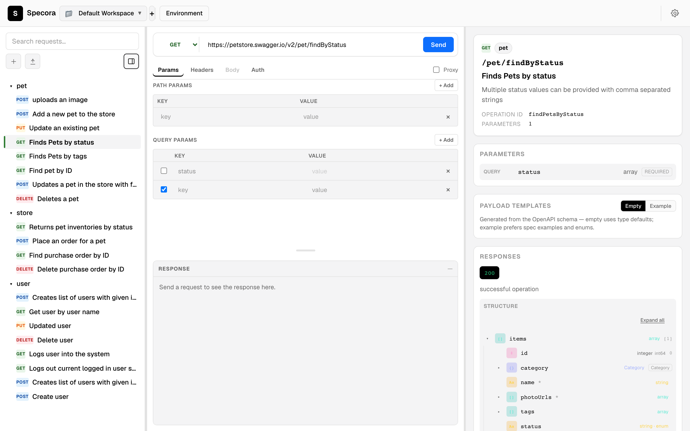
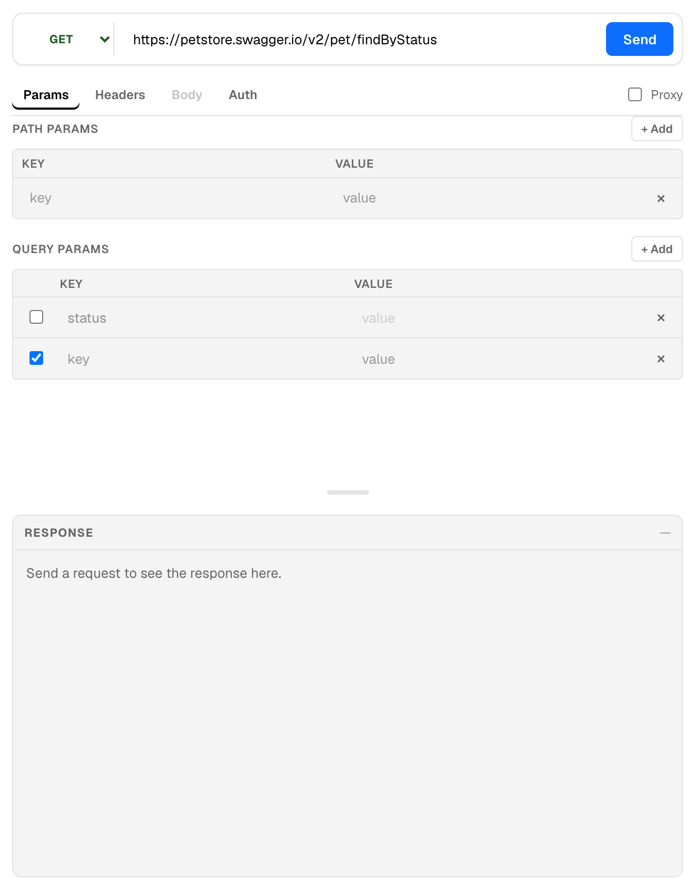
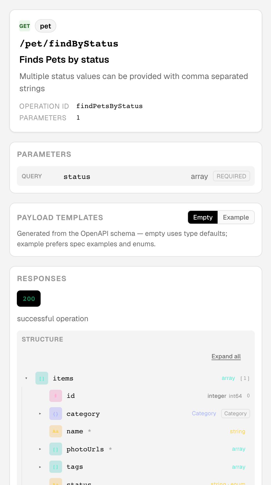

# Specora

Specora is a modern open-source OpenAPI documentation platform with:

- Web UI for URL, paste, and upload based visualization
- CLI to replace script-based validate/serve/export workflows
- Shared core parsing and normalization engine

## UI Preview

Screenshots use the official [Swagger Petstore](https://petstore.swagger.io/) spec (`https://petstore.swagger.io/v2/swagger.json`). A copy of that spec lives in [`docs/fixtures/petstore.swagger.json`](docs/fixtures/petstore.swagger.json) for demos and docs.

### API client workbench

Browse endpoints by tag, send requests, and inspect responses — collections, try-out, and schema reference in one view.



### Try it out

Configure path/query params, headers, body, and auth, then send requests against your base URL.



### Schema reference

Operation insight panel shows parameters, payload templates, and response structure from the OpenAPI definition.



To regenerate these screenshots locally (requires the web dev server on port 5173):

```bash
npm run dev:web
# in another terminal:
npm run screenshots:readme
```

## Quick Start

1. Install dependencies:

```bash
npm install
```

2. Run web app:

```bash
npm run dev:web
```

3. Run CLI in watch mode:

```bash
npm run dev:cli
```

4. Build all workspaces:

```bash
npm run build
```

## CLI Usage

Validate a local spec:

```bash
npx specora validate ./openapi.yaml
```

Validate with machine-readable JSON output:

```bash
npx specora validate ./openapi.yaml --format json
```

Serve a local preview:

```bash
npx specora serve ./openapi.yaml --port 4173
```

Export static HTML preview:

```bash
npx specora export ./openapi.yaml --output ./dist/specora-preview.html
```

Export with machine-readable JSON output:

```bash
npx specora export ./openapi.yaml --output ./dist/specora-preview.html --format json
```

Run local proxy for browser try-out when the target API has no CORS headers:

```bash
npx specora proxy --port 8787
```

In the web UI Try Out section, enable **Proxy** and set the URL to `http://localhost:8787/proxy`. Try-out defaults to direct mode (browser → target API); the local CLI proxy is the only CORS bypass on hosted SaaS — request data never passes through Specora's servers.

## Workspace Layout

- `apps/web`: React + Vite frontend
	- `src/app`: application composition and top-level screens
	- `src/features`: feature modules (spec parsing, try-out, etc.)
	- `src/shared`: shared styles and common UI helpers
- `packages/core`: shared OpenAPI parsing and normalization
	- `src/parsing`: parsing and validation pipeline
	- `src/summarization`: summary and metadata extraction
	- `src/types`: shared public contract types
- `packages/cli`: command-line workflow tool
	- `src/app`: CLI orchestration entry logic
	- `src/commands`: command-level modules
	- `src/server`: local proxy and serve server modules
	- `src/utils`: reusable CLI helpers
- `plan`: enterprise planning and governance docs

## Codebase Conventions

1. Keep business/domain logic inside feature or package modules, not in entry files.
2. Keep public APIs stable through package root exports.
3. Keep tests close to relevant module boundaries (`tests` or feature-level test files).
4. Keep `main` and `index` files thin and orchestration-only.

## Testing

Run all checks:

```bash
npm run lint
npm run build
npm run test
```

Run web-proxy contract smoke checks:

```bash
npm run smoke:proxy-contract
```

## Production

The hosted app is available at **[https://specora.varcore.dev](https://specora.varcore.dev)**.

Production builds use `apps/web/.env.production` (embed CDN, platform docs domain). After a web release, upload the embed bundle to `https://specora.varcore.dev/embed/`:

```bash
npm run publish:embed-cdn
# then sync dist/embed/ to your static host under /embed/
```

## Cloudflare Pages Deployment

This repository includes a GitHub Actions pipeline at `.github/workflows/deploy-web-cloudflare-pages.yml` to publish `apps/web` to Cloudflare Pages.

- Push to `main` deploys production.
- Pull requests deploy preview builds.
- You can also trigger it manually via `workflow_dispatch`.

### Required GitHub Secrets

Configure these repository secrets before running the deploy workflow:

- `CLOUDFLARE_API_TOKEN` (Cloudflare API token with Pages edit permissions)
- `CLOUDFLARE_ACCOUNT_ID`
- `CLOUDFLARE_PAGES_PROJECT_NAME` (existing Pages project name)

## Planning Documents

The `plan` folder contains the 6-8 week delivery plan, backlog, architecture, testing strategy, and release governance docs used to guide implementation.
